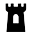

# Nebula Tower



## What It Is

Nebula Tower is a user-friendly server and client application that simplifies managing a <a href="https://github.com/slackhq/nebula">Slack Nebula</a> mesh network.

If you run the server component on a machine with a public IP address (like a $6/month Digital Ocean droplet), you can use the web interface to:

- 🔒 Create a Certificate Authority (CA) Certificate
- 🌐 Set up a Lighthouse server and its configuration
- 🖥️ Create hosts and generate their respective certificates and configs

Afterward, clients (hosts) can easily download Nebula Tower generated configuration files and connect to the Nebula network using either a simple script or a Menubar application.

## Important Considerations

This is a very early version of Nebula tower. If you find the concept helpful, let's collaborate to improve the app.

To keep things simple, Nebula Tower handles some things differently than the standard Nebula setup. We store the CA, lighthouse, and host certificates all on the tower itself. While this makes administration easier, it also means the security of your network is less decentralized than a typical Nebula deployment.

We also use the nightly version of Nebula with v2 certificates. This is because we need IPv6 support to create enough internal hosts without running into address conflicts. You can find more details on this approach in the <a href="https://nebula.defined.net/docs/guides/upgrade-to-cert-v2-and-ipv6/">official Nebula documentation on upgrading to v2 certificates and IPv6</a>.

Server Screenshot:


Menubar App Screenshot:


 
# Get Started

## Run the server:

(currently works on MacOS and Linux)

- Install <a href="https://docs.astral.sh/uv/">uv</a>

```
curl -LsSf https://astral.sh/uv/install.sh | sh
```

- <a href="https://github.com/transformerlab/nebula-tower/archive/refs/heads/main.zip">Download</a> and unzip or clone this Repo

```bash
./install_nebula_binaries.sh` # downloads nebula nightly
cd frontend
npm install # build the react app
```
- edit `frontend/.env` and set `VITE_API_BASE_URL` to your server's address e.g. http://162.243.38.134:8000 (make sure you are editing your `frontend/.env` as there is a different .env in the root of the project)

```
npm run build
cd ..
cp .env.sample .env
```

* edit .env and set the variables

- Run `uv run create_admin.py` and follow the instructions to create your first admin user (make sure to enable the promote flag)
- Now run `uv run main.py` (you will have to do sudo in front if on macOS)

## To run this in development:

Do the above but then run the frontend separately
`cd frontend; npm run dev`

# Run the Client

## Tauri app

### For Development:

go to `cd client/nebula-tower-menubar-app`
`npm install`
`npx tauri dev`

### Build for production:

`npx tauri build`
The build goes in `src-tauri/src/target/release`

# Repo Organization:

| Path                              | Description                                   |
|-----------------------------------|-----------------------------------------------|
| `main.py`                         | Root file, server starting point              |
| `frontend/`                       | React app for the server                      |
| `data/`                           | Directory where the server stores data    |
| `bin/`                            | Directory where Nebula binaries live          |
| `client/nebula-tower-menubar-app` | Directory for the client Menubar application  |

# License

GNU AFFERO GENERAL PUBLIC LICENSE v3
